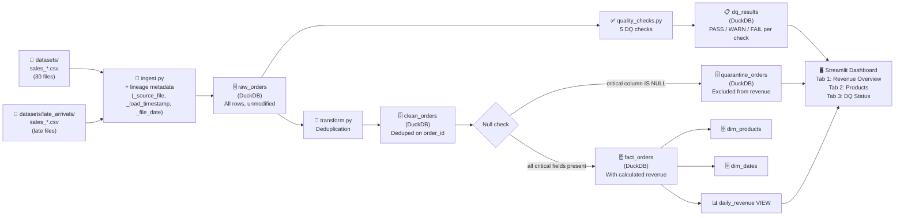

# Data Lineage

## Pipeline Flow

## Table Descriptions

| Table | Layer | Description |
|-------|-------|-------------|
| `raw_orders` | Raw | All ingested rows. Every source file row lands here. |
| `dq_results` | Meta | Output of 5 DQ checks. Dashboard reads this for DQ tab. |
| `clean_orders` | Clean | Deduplicated: one row per `order_id` (latest load wins). |
| `quarantine_orders` | Quarantine | Rows with nulls in critical fields, excluded from revenue. |
| `fact_orders` | Modeled | Clean rows with calculated `revenue`. Source of truth. |
| `dim_products` | Dimension | One row per product (latest state). |
| `dim_dates` | Dimension | One row per date with calendar attributes. |
| `daily_revenue` | View | Aggregated revenue per day. Dashboard's primary data source. |

## Lineage Columns

Every row in `fact_orders` retains:
- `_source_file` — which CSV file it came from (e.g., `sales_2025-03-01.csv`)
- `_file_date` — the date that file represents

This enables the CFO investigation runbook: any revenue number can be traced back to a specific source file.
